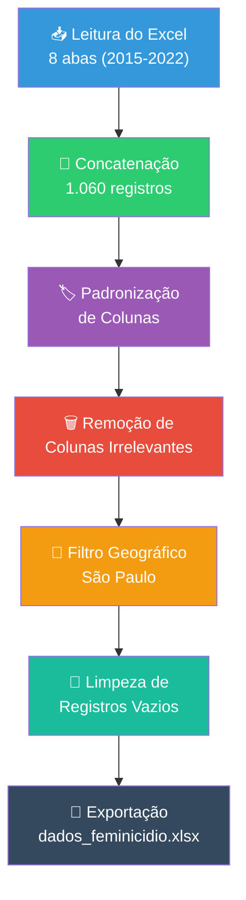

<div align="center">

# 🔬 DEAM-PP — Avaliação de Impacto das Delegacias Especializadas de Atendimento à Mulher

**Álcool e Violência Doméstica contra Mulheres no Brasil:**
*Diagnóstico Espaço-Temporal e Avaliação de Impacto Causal das DEAMs*

[]()
[]()
[]()
[]()
[]()

---

*Projeto de pesquisa vinculado ao **Edital DPG/MJSP 07/2026** — Tema 2.1.10*
*Revisão Sistemática de Evidências sobre Uso de Álcool e a Prática de Violência Doméstica*

</div>

---

## 📋 Sumário

- [Sobre o Projeto](#-sobre-o-projeto)
- [Problema de Pesquisa](#-problema-de-pesquisa)
- [Cadeia Causal](#-cadeia-causal)
- [Metodologia](#-metodologia)
- [Estrutura do Repositório](#-estrutura-do-repositório)
- [Dados](#-dados)
- [Pipeline de Dados](#-pipeline-de-dados)
- [Como Usar](#-como-usar)
- [Roadmap](#-roadmap)
- [Referências](#-referências)
- [Equipe](#-equipe)

---

## 🎯 Sobre o Projeto

Este repositório contém o código-fonte, dados e relatórios do projeto de pesquisa que investiga a **relação causal entre a presença de Delegacias Especializadas de Atendimento à Mulher (DEAMs) e a dinâmica de violência doméstica no município de São Paulo**, com foco especial no papel do álcool como fator agravante.

O estudo combina **diagnóstico descritivo** (análise espacial e temporal) com **avaliação de impacto causal** (Diferenças-em-Diferenças), produzindo evidências robustas para subsidiar políticas públicas de enfrentamento à violência contra a mulher.

> [!IMPORTANT]
> Este projeto é financiado pelo **Ministério da Justiça e Segurança Pública** através do Edital DPG/MJSP 07/2026 e segue rigorosos padrões éticos e metodológicos de pesquisa.

---

## 🔍 Problema de Pesquisa

A violência doméstica contra mulheres constitui problema de elevada gravidade social e institucional no Brasil. Dados do Anuário Brasileiro de Segurança Pública (2025) registram centenas de milhares de casos anuais de lesão corporal dolosa no âmbito doméstico.

Três lacunas fundamentais motivam esta pesquisa:

| Lacuna | Descrição |
|--------|-----------|
| 🗺️ **Espacial** | Carência de estudos com análise de dependência espacial (Índice de Moran) para verificar hotspots de transbordamento entre municípios vizinhos |
| ⏰ **Temporal** | A dimensão temporal (picos em finais de semana e madrugadas) ainda não foi investigada no Brasil com estatística circular |
| ⚖️ **Causal** | Não há avaliação de impacto causal que isole o efeito das DEAMs diferenciando notificação de letalidade, nem que compare regimes de funcionamento (comercial vs. 24h) |

---

## 🔗 Cadeia Causal

O projeto é estruturado em uma **cadeia causal com duas variáveis dependentes**, resolvendo o paradoxo econométrico da causalidade reversa de registro:


> **Lógica:** A DEAM aumenta a denúncia (canal de acesso) → aciona mecanismos de proteção → resulta em redução da letalidade.

> [!NOTE]
> Um coeficiente positivo na variável de denúncias **não** significa aumento da violência, mas sim **redução da cifra oculta do crime** (efeito informação/acolhimento).

---

## 📐 Metodologia

### Etapa 1 — Diagnóstico Espaço-Temporal
- **Análise de Dependência Espacial** → Índice de Moran (Global e Local — LISA)
- **Estatística Circular** → Identificação de picos horários e sazonais de ocorrências
- **Fontes:** Microdados SINAN, SINESP, SIM/DataSUS

### Etapa 2 — Avaliação de Impacto Causal
- **Método:** Diferenças-em-Diferenças com adoção defasada (*Staggered DiD*) — Callaway & Sant'Anna (2021)
- **Contrafactual:** DEAMs em horário comercial vs. DEAMs 24 horas
- **Pareamento:** Propensity Score Matching via dados IBGE/FINBRA

### Produto Final
- 📊 Relatório técnico
- 🖥️ Dashboard interativo (Streamlit/Plotly) com filtros: denúncias vs. feminicídios e DEAMs 24h vs. convencionais

---

## 📁 Estrutura do Repositório

```
deams-pp/
│
├── 📄 README.md                 # Este arquivo
│
├── 📂 codes/                    # Scripts de processamento e análise
│   ├── pipeline_feminicidio.py  # Pipeline de limpeza da base de feminicídios (2015-2022)
│   └── data_filter.py           # Pipeline de filtragem da base SIPCV (2026)
│
├── 📂 dados/                    # Bases de dados brutas e processadas
│   ├── Feminicidio_2015_2022.xlsx   # Base bruta — feminicídios (8 abas anuais)
│   ├── SIPCV_2026.xlsx              # Base bruta — Sistema Paulista de Coleta de Dados
│   └── dados_feminicidio.xlsx       # Base tratada — feminicídios filtrados (São Paulo)
│
├── 📂 edital/                   # Documentação do edital
│   └── Edital_DPG_MJSP_07_2026.pdf
│
└── 📂 relatorios/               # Relatórios e projeto de pesquisa
    └── Projeto_DPG_MJSP_07_2026_REVISADO.docx
```

---

## 📊 Dados

### Fontes Primárias

| Base | Descrição | Período | Registros |
|------|-----------|---------|-----------|
| **Feminicídio SSP/SP** | Ocorrências de feminicídios no estado de São Paulo | 2015–2022 | 1.060 (bruto) → 232 (SP) |
| **SIPCV** | Sistema Paulista de Coleta de Dados — BOs de violência doméstica | 2026 | ~93 MB |

### Variáveis Retidas (Base Feminicídio)

Após a limpeza, as seguintes variáveis foram mantidas no dataset final:

| Variável | Papel no Modelo |
|----------|-----------------|
| `NUM_BO`, `ANO_BO` | Identificação |
| `DATA_FATO`, `HORA_FATO` | Dimensão temporal |
| `LATITUDE`, `LONGITUDE` | Georreferenciamento (running variable) |
| `MUNICIPIO_CIRCUNSCRICAO`, `DP_CIRCUNSCRICAO` | Jurisdição policial |
| `DEPARTAMENTO_CIRCUNSCRICAO`, `SECCIONAL_CIRCUNSCRICAO` | Hierarquia institucional |
| `HD`, `N_VITIMAS_HD` | Indicadores de homicídio doloso |
| `IDADE_PESSOA`, `COR_PELE`, `PROFISSAO` | Covariáveis socioeconômicas |
| `DESC_TIPOLOCAL` | Contexto do crime |

> [!WARNING]
> Os dados brutos contêm informações sensíveis. O uso é estritamente acadêmico, conforme termos do Edital DPG/MJSP 07/2026.

---

## ⚙️ Pipeline de Dados

### `pipeline_feminicidio.py`

Pipeline ETL para a base de feminicídios:



**Colunas removidas** (pouco úteis para o estudo, conforme projeto):
`DESDOBRAMENTO` · `NATUREZA_APURADA` · `DATA_NASCIMENTO_PESSOA` · `SEXO_PESSOA` · `TIPO_PESSOA` · `NUMERO_LOGRADOURO` · `LOGRADOURO`

### `data_filter.py`

Pipeline ETL para a base SIPCV com foco em Spatial RDD:
1. Filtro de vítimas do sexo feminino
2. Filtro de tipificação (Lesão Corporal / Ameaça)
3. Filtro de contexto (Violência Doméstica / Maria da Penha)
4. Seleção de variáveis de interesse (Y, D, X, distância)

---

## 🚀 Como Usar

### Pré-requisitos

```bash
python >= 3.10
pandas >= 2.0
openpyxl >= 3.1
```

### Instalação

```bash
# Clone o repositório
git clone https://github.com/felipesantanafs/deams-pp.git
cd deams-pp

# Instale as dependências
pip install pandas openpyxl
```

### Executar os Pipelines

```bash
# Pipeline de feminicídios (gera/sobrescreve dados_feminicidio.xlsx)
python codes/pipeline_feminicidio.py

# Pipeline SIPCV (gera/sobrescreve data_sipcv.csv)
python codes/data_filter.py
```

> [!TIP]
> Os scripts são **idempotentes** — podem ser executados quantas vezes forem necessárias. A planilha de saída é sempre sobrescrita, nunca duplicada.

---

## 🗺️ Roadmap

- [x] Estruturação do repositório
- [x] Pipeline de limpeza da base de feminicídios
- [x] Pipeline de filtragem da base SIPCV
- [x] Filtro geográfico (Região Metropolitana de São Paulo)
- [ ] Análise exploratória de dados (EDA)
- [ ] Análise de dependência espacial (Índice de Moran)
- [ ] Estatística circular (picos horários/sazonais)
- [ ] Propensity Score Matching
- [ ] Estimação Staggered DiD (Callaway & Sant'Anna)
- [ ] Dashboard interativo (Streamlit/Plotly)
- [ ] Relatório técnico final

---

## 📚 Referências

- Callaway, B., & Sant'Anna, P. H. (2021). Difference-in-Differences with multiple time periods. *Journal of Econometrics*, 225(2), 200–230.
- Devries, K. M., et al. (2014). The global prevalence of intimate partner violence against women. *Science*, 340(6140), 1527–1528.
- Foran, H. M., & O'Leary, K. D. (2008). Alcohol and intimate partner violence: A meta-analytic review. *Clinical Psychology Review*, 28(7), 1222–1234.

---

## 👥 Equipe

| Nome | Papel |
|------|-------|
| **Felipe Santana** | Pesquisador Principal |

---

<div align="center">

*Projeto desenvolvido no âmbito do Edital DPG/MJSP 07/2026*
*Ministério da Justiça e Segurança Pública — Brasil 🇧🇷*

</div>